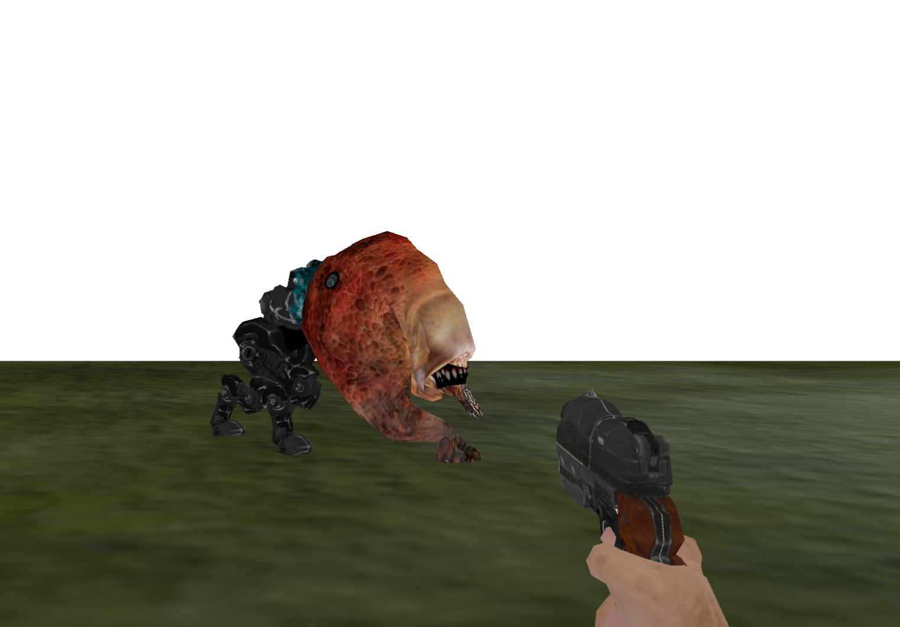

<!DOCTYPE html>
<html>
<body>

<h1>The game engine 'MiniGame' powered by DirectX12</h1>
  <b>Platforms:</b> Windows
  <b>Technologies:</b> C++ 17, DirectX12, DirectXTK12(user input), CMake, WinApi, stb_image, directxmath

This is simple game engine based on own engine run by DirectX12, DirectXTK12 utils(user input)
currently it supports such features as
<ol>
  <li>support for animated models (md5 format), the parser was implemented from scratch it's the port of OpenGL based parser of ID TECH 4 engine (Doom 3) with reworked math and rendering api;
  in short the animation is calculated by directxmath and then generated submeshes of current frame are pushed to DirectX12 pipeline </li>
  </li>
</ol>

<b>HOWTO BUILD:</b>
 
You have to fetch DirectXTK12 lib as git submodule before building
 
git submodule init && cd build
 
 
<b><i>cmake.exe ..\ -G "Visual Studio 17 2022"</i></b>
 
<b><i>cmake --target "ALL_BUILD" --config "Release"</i></b>
 

</body>
</html>
